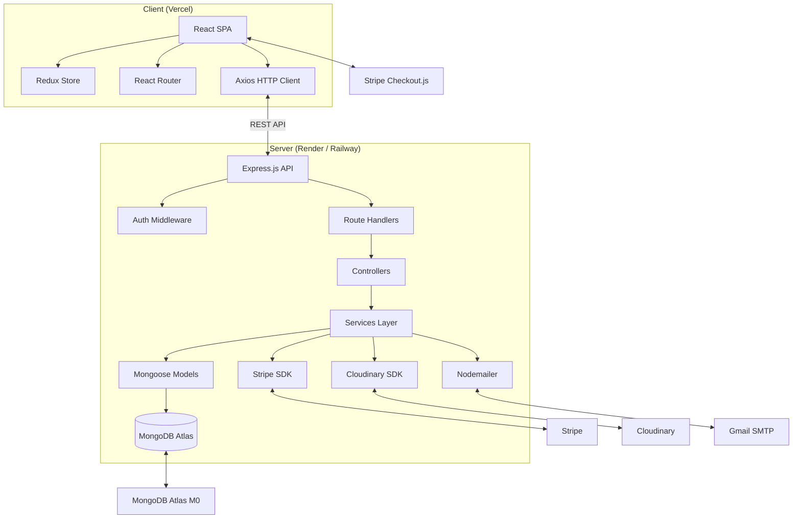
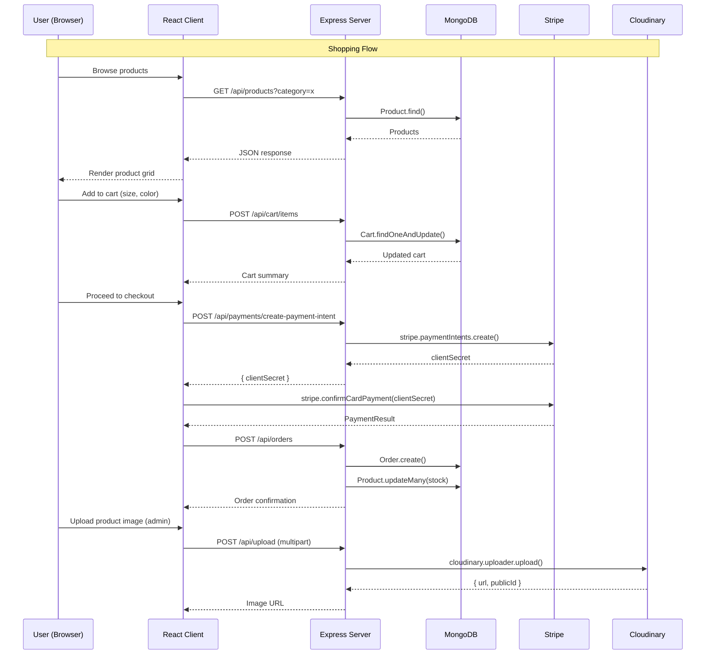

# 👕 Laspero — Clothing E-Commerce Platform

A full-stack web-based clothing shopping platform built for students, startups, and personal projects. Supports **Admin** and **Customer** roles with all essential e-commerce modules.

---

## ✨ Project Overview

Laspero is a modern, open-source e-commerce application focused on clothing retail. It provides a complete shopping experience including product browsing, search and filtering, cart/wishlist management, checkout and payment processing, order tracking, and an admin dashboard for managing products, inventory, coupons, and analytics.

**Goals:**
- Deliver a production-ready e-commerce template for clothing brands
- Keep hosting and operational costs near zero
- Use a beginner-friendly stack that follows industry best practices
- Scale comfortably for small-to-medium traffic (up to ~10K daily users)

---

## 🧰 Recommended Tech Stack

| Layer              | Technology                                                          | Why                                                               | Cost               |
| ------------------ | ------------------------------------------------------------------- | ----------------------------------------------------------------- | ------------------ |
| **Frontend**       | React 18 + Vite + Tailwind CSS + Redux Toolkit (or Zustand)        | Fast DX, responsive UI, state management                          | Free               |
| **Backend**        | Node.js + Express.js                                                | Popular, simple, massive ecosystem                                | Free               |
| **Database**       | MongoDB (Mongoose ODM)                                              | Flexible schema for clothing variants (size/color), easy to start | Free (Atlas M0)    |
| **Auth**           | JWT + bcrypt + httpOnly cookies                                     | Stateless, secure, no extra service cost                          | Free               |
| **File Storage**   | Cloudinary (free tier)                                              | 25 GB storage, image transformations, CDN                         | Free               |
| **Payments**       | Stripe (test mode) / PayPal Sandbox                                 | Industry standard, test mode is free                              | Free               |
| **Email**          | Nodemailer + Gmail SMTP / Resend (free tier)                        | Transactional emails (orders, password reset)                     | Free               |
| **Frontend Host**  | Vercel                                                              | Free tier, auto-deploy from GitHub                                | Free               |
| **Backend Host**   | Render (free tier) or Railway (free tier)                           | Free web service + PostgreSQL (if needed), SSL                    | Free               |
| **Analytics**      | Custom lightweight events (or Plausible / Umami self-host)          | Privacy-friendly, no cost                                         | Free               |
| **Maps**           | Leaflet + OpenStreetMap (or MapLibre)                               | Free map for store locator / delivery areas                       | Free               |

### Why MongoDB over SQL?

Clothing products have highly variable attributes (size, color, fabric, pattern). MongoDB's document model stores these as nested arrays without joins, simplifying queries and reducing development time. For order/inventory data where consistency matters, Mongoose validation and atomic operations provide sufficient guarantees at this scale.

---

## 📁 Folder Structure

```
laspero/
├── client/                          # React frontend
│   ├── public/
│   ├── src/
│   │   ├── api/                     # Axios instance & API functions
│   │   ├── assets/                  # Images, icons, fonts
│   │   ├── components/              # Shared UI components
│   │   │   ├── layout/              # Navbar, Footer, Sidebar
│   │   │   ├── product/             # ProductCard, SizeSelector, ColorPicker
│   │   │   ├── cart/                # CartItem, CartSummary
│   │   │   └── ui/                  # Button, Modal, Input, Spinner, etc.
│   │   ├── features/                # Redux slices (auth, cart, wishlist, etc.)
│   │   ├── hooks/                   # Custom hooks (useAuth, useCart, etc.)
│   │   ├── pages/                   # Route pages
│   │   │   ├── home/
│   │   │   ├── shop/
│   │   │   ├── product/[id]/
│   │   │   ├── cart/
│   │   │   ├── checkout/
│   │   │   ├── orders/
│   │   │   ├── wishlist/
│   │   │   ├── auth/                # Login, Register, ForgotPassword
│   │   │   ├── account/             # Profile, Addresses
│   │   │   └── admin/               # Dashboard, Products, Orders, Coupons
│   │   ├── routes/                  # React Router config
│   │   ├── utils/                   # Helpers, constants, validators
│   │   ├── App.jsx
│   │   └── main.jsx
│   ├── index.html
│   ├── tailwind.config.js
│   ├── vite.config.js
│   └── package.json
│
├── server/                          # Express backend
│   ├── src/
│   │   ├── config/                  # DB, env, Stripe, Cloudinary config
│   │   ├── controllers/             # Route handlers
│   │   │   ├── auth.controller.js
│   │   │   ├── user.controller.js
│   │   │   ├── product.controller.js
│   │   │   ├── category.controller.js
│   │   │   ├── brand.controller.js
│   │   │   ├── cart.controller.js
│   │   │   ├── wishlist.controller.js
│   │   │   ├── order.controller.js
│   │   │   ├── review.controller.js
│   │   │   ├── coupon.controller.js
│   │   │   ├── payment.controller.js
│   │   │   ├── upload.controller.js
│   │   │   └── analytics.controller.js
│   │   ├── middleware/              # Auth, admin, validation, error handler
│   │   ├── models/                  # Mongoose schemas
│   │   ├── routes/                  # Express routers
│   │   ├── services/                # Business logic (email, payments, etc.)
│   │   ├── utils/                   # Helpers, tokens, API errors
│   │   ├── validators/              # Joi / express-validator schemas
│   │   └── app.js                   # Express app setup
│   ├── server.js                    # Entry point
│   └── package.json
│
├── .env.example
├── .gitignore
├── package.json                     # Root workspace scripts
└── README.md
```

---

## 👥 User Roles & Permissions

| Permission               | Customer | Admin |
| ------------------------ | -------- | ----- |
| Browse products          | ✅       | ✅    |
| Search & filter          | ✅       | ✅    |
| View product details     | ✅       | ✅    |
| Register / Login         | ✅       | ✅    |
| Manage profile           | ✅       | ✅    |
| Add to cart              | ✅       | ✅    |
| Manage wishlist          | ✅       | ✅    |
| Place orders             | ✅       | ✅    |
| Write reviews            | ✅       | ✅    |
| View order history       | ✅       | ✅    |
| Create/Edit products     | ❌       | ✅    |
| Delete products          | ❌       | ✅    |
| Manage inventory         | ❌       | ✅    |
| Manage categories/brands | ❌       | ✅    |
| Manage coupons           | ❌       | ✅    |
| View all orders          | ❌       | ✅    |
| Update order status      | ❌       | ✅    |
| Manage users             | ❌       | ✅    |
| View analytics           | ❌       | ✅    |
| Manage homepage content  | ❌       | ✅    |

---

## 🧩 Modules & Features

### 🔐 Authentication Module

| Feature                    | Customer | Admin | Details                                              |
| -------------------------- | -------- | ----- | ---------------------------------------------------- |
| Register with email        | ✅       | ✅    | Name, email, password; email verification link       |
| Login / Logout             | ✅       | ✅    | JWT stored in httpOnly cookie; refresh token         |
| Forgot / Reset password    | ✅       | ✅    | Email with time-limited token                        |
| Profile management         | ✅       | ✅    | Update name, email, phone, avatar                    |
| Session persistence        | ✅       | ✅    | Silent token refresh on page load                    |
| Admin seed / invite        | ❌       | ✅    | First admin created via CLI seed script               |

### 🛍️ Product Catalog

| Feature                    | Customer | Admin | Details                                                |
| -------------------------- | -------- | ----- | ------------------------------------------------------ |
| Grid / list view           | ✅       | ✅    | Responsive cards with image, name, price, rating       |
| Product detail page        | ✅       | ✅    | Images gallery, size/color selector, description, reviews |
| Featured / new arrivals    | ✅       | ✅    | Admin flags products as "featured" or "new"            |
| Related products           | ✅       | ✅    | Based on same category or tags                         |
| Recently viewed            | ✅       | ❌    | Stored in localStorage                                 |
| Product CRUD               | ❌       | ✅    | Create, edit, duplicate, archive, delete               |
| Bulk import via CSV        | ❌       | ✅    | Upload CSV with product data                           |
| Image upload               | ❌       | ✅    | Multi-image upload to Cloudinary; auto-generate thumbnails |

### 🔍 Search & Filters

| Feature                    | Customer | Admin | Details                                                |
| -------------------------- | -------- | ----- | ------------------------------------------------------ |
| Full-text search           | ✅       | ✅    | MongoDB text index on name, description, tags          |
| Category filter            | ✅       | ✅    | Sidebar / dropdown                                     |
| Size / Color filter        | ✅       | ✅    | Checkboxes for available variants                      |
| Price range slider         | ✅       | ✅    | Min–max with debounced input                           |
| Brand filter               | ✅       | ✅    | Checkbox list                                          |
| Sort options               | ✅       | ✅    | Price (low/high), newest, rating, popularity            |
| Attribute filter           | ✅       | ❌    | Fabric, fit, pattern, etc.                             |
| Mobile responsive filters  | ✅       | ❌    | Slide-out drawer on small screens                      |

### 🛒 Shopping Cart

| Feature                    | Customer | Admin | Details                                                |
| -------------------------- | -------- | ----- | ------------------------------------------------------ |
| Add to cart                | ✅       | ✅    | Select size & color; validation for stock              |
| Quantity adjustment        | ✅       | ✅    | +/- buttons; stock limit enforcement                   |
| Remove items               | ✅       | ✅    | With confirmation                                      |
| Cart summary               | ✅       | ✅    | Subtotal, discount, shipping, tax, total                |
| Apply coupon               | ✅       | ✅    | Code input; real-time validation                       |
| Save for later             | ✅       | ❌    | Move item to wishlist                                  |
| Persistent cart            | ✅       | ❌    | Stored in DB for logged-in users; localStorage for guests |
| Merge guest cart on login  | ✅       | ❌    | Anonymous cart items merge into user's DB cart         |

### ❤️ Wishlist

| Feature                    | Customer | Admin | Details                                                |
| -------------------------- | -------- | ----- | ------------------------------------------------------ |
| Add / remove product       | ✅       | ❌    | Heart toggle icon                                      |
| View wishlist              | ✅       | ❌    | Dedicated page with product cards                      |
| Move to cart               | ✅       | ❌    | Single-click add with selected variant                  |
| Share wishlist             | ✅       | ❌    | Public link (optional)                                 |

### 📦 Checkout & Orders

| Feature                    | Customer | Admin | Details                                                |
| -------------------------- | -------- | ----- | ------------------------------------------------------ |
| Address management         | ✅       | ❌    | Add, edit, delete multiple addresses                   |
| Shipping method selection  | ✅       | ❌    | Standard / express (configurable rates)                |
| Order review               | ✅       | ❌    | Item list, address, payment summary before submit       |
| Place order                | ✅       | ❌    | Creates order record; decrements inventory             |
| Order confirmation         | ✅       | ❌    | Success page + email confirmation                      |
| Order history              | ✅       | ✅    | Paginated list with status badges                      |
| Order details              | ✅       | ✅    | Items, timeline, shipping info, invoice                |
| Cancel order               | ✅       | ❌    | Within cancellation window; auto-refund logic          |
| View all orders            | ❌       | ✅    | Filter by status, date, customer                       |
| Update order status        | ❌       | ✅    | Confirmed → Processing → Shipped → Delivered           |
| Print invoice / label      | ❌       | ✅    | PDF generation (optional)                              |

### 💳 Payment Processing

| Feature                    | Customer | Admin | Details                                                |
| -------------------------- | -------- | ----- | ------------------------------------------------------ |
| Stripe Checkout integration| ✅       | ❌    | Hosted Stripe payment page                             |
| COD (cash on delivery)     | ✅       | ❌    | Optional flag per order                                |
| Payment status tracking    | ✅       | ✅    | pending, paid, failed, refunded                        |
| Refund processing          | ❌       | ✅    | Manual refund via Stripe dashboard + status update     |
| Payment history            | ✅       | ✅    | Transaction ID, amount, date, status                   |

### 🏷️ Coupon & Discount System

| Feature                    | Customer | Admin | Details                                                |
| -------------------------- | -------- | ----- | ------------------------------------------------------ |
| Coupon CRUD                | ❌       | ✅    | Code, type (percentage / fixed), min cart value        |
| Usage limits               | ❌       | ✅    | Per-coupon & per-user caps                             |
| Date validity              | ❌       | ✅    | Start & end date                                       |
| Auto-apply discounts       | ✅       | ❌    | Validated at checkout                                  |
| Cart-level & product-level | ❌       | ✅    | Apply to entire cart or specific products/categories   |

### ⭐ Reviews & Ratings

| Feature                    | Customer | Admin | Details                                                |
| -------------------------- | -------- | ----- | ------------------------------------------------------ |
| Write review               | ✅       | ❌    | Rating (1–5) + text; must have purchased the product   |
| Edit / delete own review   | ✅       | ❌    | Within edit window                                     |
| Approve / reject review    | ❌       | ✅    | Prevent spam before publication                        |
| Average rating             | ✅       | ✅    | Computed on product read; stored for performance       |
| Verified purchase badge    | ✅       | ❌    | Auto-applied to reviews from confirmed orders          |

### 📊 Admin Analytics Dashboard

| Feature                    | Details                                                  |
| -------------------------- | -------------------------------------------------------- |
| Revenue overview           | Total revenue, today, this week, this month, chart       |
| Order stats                | Total orders, by status, average order value             |
| Top products               | By revenue & quantity sold                               |
| Top categories             | Revenue breakdown by category                            |
| User metrics               | New users, total users, conversion rate (visitor → buyer)|
| Inventory alerts           | Low-stock & out-of-stock products                        |
| Recent orders              | Live list of latest orders                               |
| Sales graph                | Line chart (7d / 30d / 12m)                              |

### 📬 Notifications

| Feature                    | Customer | Admin | Details                                                |
| -------------------------- | -------- | ----- | ------------------------------------------------------ |
| Order confirmation email   | ✅       | ❌    | Nodemailer + HTML template                             |
| Shipping update email      | ✅       | ❌    | Triggered on status change                              |
| Password reset email       | ✅       | ❌    | Time-limited secure link                               |
| Welcome email              | ✅       | ❌    | On successful registration                             |
| Low stock alert            | ❌       | ✅    | Email / in-app notification                            |
| New order notification     | ❌       | ✅    | In-app toast + email                                   |

---

## 🗄️ Database Collections (MongoDB / Mongoose)

### `users`

| Field       | Type     | Notes                                    |
| ----------- | -------- | ---------------------------------------- |
| name        | String   | required                                 |
| email       | String   | unique, required, lowercase              |
| password    | String   | bcrypt hash, required                    |
| role        | String   | `"customer"` or `"admin"`, default `"customer"` |
| avatar      | String   | Cloudinary URL                           |
| phone       | String   | optional                                 |
| isVerified  | Boolean  | email verification flag                  |
| refreshToken| String   | hashed refresh token                     |
| createdAt   | Date     | auto                                     |
| updatedAt   | Date     | auto                                     |

### `products`

| Field         | Type     | Notes                                        |
| ------------- | -------- | -------------------------------------------- |
| name          | String   | required                                     |
| slug          | String   | unique, auto-generated from name             |
| description   | String   | rich text (HTML or Markdown)                 |
| category      | ObjectId | ref `categories`                             |
| brand         | ObjectId | ref `brands`                                 |
| images        | [String] | Cloudinary URLs; first is primary            |
| price         | Number   | required                                     |
| offerPrice  | Number   | original price for sale badge                |
| costPrice     | Number   | internal; for margin calculation             |
| variants      | [Object] | `[{ size, color, sku, stock, images }]`      |
| tags          | [String] | search keywords                              |
| gender        | String   | `men`, `women`, `unisex`, `kids`             |
| fabric        | String   | cotton, polyester, etc.                      |
| fit           | String   | slim, regular, oversized                     |
| pattern       | String   | solid, striped, floral                       |
| featured      | Boolean  | show on homepage                             |
| isNew         | Boolean  | "New arrival" badge                          |
| isActive      | Boolean  | soft delete / hide                           |
| avgRating     | Number   | computed average, default 0                  |
| numReviews    | Number   | review count, default 0                      |
| soldCount     | Number   | popularity sort                              |
| createdAt     | Date     | auto                                         |
| updatedAt     | Date     | auto                                         |

### `categories`

| Field       | Type     | Notes                        |
| ----------- | -------- | ---------------------------- |
| name        | String   | required, unique             |
| slug        | String   | unique, auto-generated       |
| description | String   | optional                     |
| image       | String   | optional                     |
| parent      | ObjectId | ref `categories` (null = top) |
| isActive    | Boolean  |                              |
| order       | Number   | sort priority                |

### `brands`

| Field       | Type     | Notes                  |
| ----------- | -------- | ---------------------- |
| name        | String   | required, unique       |
| slug        | String   | unique, auto-generated |
| logo        | String   | optional               |
| description | String   | optional               |
| isActive    | Boolean  |                        |

### `carts`

| Field     | Type     | Notes                    |
| --------- | -------- | ------------------------ |
| user      | ObjectId | ref `users`, unique      |
| items     | [Object] | `[{ product, variantSku, quantity }]` |
| total     | Number   | computed                 |
| updatedAt | Date     | auto                     |

### `wishlists`

| Field     | Type       | Notes                          |
| --------- | ---------- | ------------------------------ |
| user      | ObjectId   | ref `users`, unique            |
| products  | [ObjectId] | ref `products`                 |
| updatedAt | Date       | auto                           |

### `orders`

| Field           | Type       | Notes                                          |
| --------------- | ---------- | ---------------------------------------------- |
| user            | ObjectId   | ref `users`                                    |
| orderNumber     | String     | unique, auto-generated (e.g. `LS-20241201-XXXX`) |
| items           | [Object]   | `[{ product, name, image, size, color, sku, price, quantity }]` |
| shippingAddress | Object     | full address snapshot                          |
| paymentMethod   | String     | `stripe` or `cod`                              |
| paymentStatus   | String     | `pending`, `paid`, `failed`, `refunded`        |
| paymentId       | String     | Stripe PaymentIntent ID                        |
| subtotal        | Number     | before discounts & shipping                    |
| discount        | Number     | coupon discount amount                         |
| couponCode      | String     | applied coupon code                            |
| shippingCost    | Number     | calculated based on method                     |
| tax             | Number     | calculated based on address                    |
| total           | Number     | final amount                                   |
| status          | String     | `confirmed`, `processing`, `shipped`, `delivered`, `cancelled` |
| statusHistory   | [Object]   | `[{ status, timestamp, note }]`               |
| trackingNumber  | String     | optional                                       |
| deliveredAt     | Date       |                                                |
| notes           | String     | customer order notes                           |
| createdAt       | Date       | auto                                           |

### `reviews`

| Field       | Type       | Notes                                    |
| ----------- | ---------- | ---------------------------------------- |
| user        | ObjectId   | ref `users`                              |
| product     | ObjectId   | ref `products`                           |
| order       | ObjectId   | ref `orders` (for verified badge)        |
| rating      | Number     | 1–5, required                            |
| title       | String     | optional                                 |
| comment     | String     | optional                                 |
| isApproved  | Boolean    | admin moderation, default `false`        |
| createdAt   | Date       | auto                                     |

### `coupons`

| Field         | Type       | Notes                                    |
| ------------- | ---------- | ---------------------------------------- |
| code          | String     | unique, uppercase                        |
| type          | String     | `percentage` or `fixed`                  |
| value         | Number     | percentage (e.g. 10) or fixed amount     |
| minCartValue  | Number     | minimum order subtotal                   |
| maxDiscount   | Number     | cap for percentage coupons               |
| usageLimit    | Number     | total uses allowed (null = unlimited)    |
| usedCount     | Number     | current usage count                      |
| perUserLimit  | Number     | max uses per user                        |
| usedBy        | [ObjectId] | ref `users` who used the coupon          |
| validFrom     | Date       | start date                               |
| validUntil    | Date       | expiry date                              |
| isActive      | Boolean    | toggle                                    |
| applicableProducts | [ObjectId] | specific products (empty = all)     |
| applicableCategories | [ObjectId] | specific categories (empty = all) |
| createdAt     | Date       | auto                                     |

### `addresses`

| Field       | Type       | Notes                              |
| ----------- | ---------- | ---------------------------------- |
| user        | ObjectId   | ref `users`                        |
| label       | String     | "Home", "Work", etc.               |
| fullName    | String     |                                    |
| phone       | String     |                                    |
| line1       | String     | street address                     |
| line2       | String     | apartment, suite, etc.             |
| city        | String     |                                    |
| state       | String     |                                    |
| zipCode     | String     |                                    |
| country     | String     | ISO code                           |
| isDefault   | Boolean    |                                    |

---

## 🌐 REST API Endpoints

### Auth
| Method | Endpoint                | Auth     | Description              |
| ------ | ----------------------- | -------- | ------------------------ |
| POST   | `/api/auth/register`    | —        | Register new user        |
| POST   | `/api/auth/login`       | —        | Login                    |
| POST   | `/api/auth/logout`      | —        | Logout                   |
| POST   | `/api/auth/refresh`     | —        | Refresh tokens           |
| GET    | `/api/auth/me`          | Customer | Get current user profile |
| PUT    | `/api/auth/profile`     | Customer | Update profile           |
| POST   | `/api/auth/verify-email`| —        | Request email verification |
| GET    | `/api/auth/verify/:token`| —       | Verify email             |
| POST   | `/api/auth/forgot-password` | —    | Send reset email         |
| POST   | `/api/auth/reset-password/:token` | — | Reset password     |

### Products
| Method | Endpoint                       | Auth     | Description                  |
| ------ | ------------------------------ | -------- | ---------------------------- |
| GET    | `/api/products`                | —        | List products (search, filter, sort, paginate) |
| GET    | `/api/products/:slug`          | —        | Get single product           |
| GET    | `/api/products/featured`       | —        | Get featured products        |
| GET    | `/api/products/new-arrivals`   | —        | Get new arrivals             |
| GET    | `/api/products/related/:id`    | —        | Get related products         |
| POST   | `/api/products`                | Admin    | Create product               |
| PUT    | `/api/products/:id`            | Admin    | Update product               |
| DELETE | `/api/products/:id`            | Admin    | Delete / archive product     |
| POST   | `/api/products/bulk-import`    | Admin    | CSV bulk import              |

### Categories
| Method | Endpoint                   | Auth     | Description              |
| ------ | -------------------------- | -------- | ------------------------ |
| GET    | `/api/categories`          | —        | List all categories      |
| GET    | `/api/categories/:slug`    | —        | Get single + children    |
| POST   | `/api/categories`          | Admin    | Create category          |
| PUT    | `/api/categories/:id`      | Admin    | Update category          |
| DELETE | `/api/categories/:id`      | Admin    | Delete category          |

### Brands
| Method | Endpoint                | Auth     | Description              |
| ------ | ----------------------- | -------- | ------------------------ |
| GET    | `/api/brands`           | —        | List all brands          |
| POST   | `/api/brands`           | Admin    | Create brand             |
| PUT    | `/api/brands/:id`       | Admin    | Update brand             |
| DELETE | `/api/brands/:id`       | Admin    | Delete brand             |

### Cart
| Method | Endpoint               | Auth     | Description              |
| ------ | ---------------------- | -------- | ------------------------ |
| GET    | `/api/cart`            | Customer | Get user's cart          |
| POST   | `/api/cart/items`      | Customer | Add item to cart         |
| PUT    | `/api/cart/items/:id`  | Customer | Update item quantity     |
| DELETE | `/api/cart/items/:id`  | Customer | Remove item from cart    |
| DELETE | `/api/cart`            | Customer | Clear cart               |
| POST   | `/api/cart/merge`      | Customer | Merge guest cart on login |

### Wishlist
| Method | Endpoint                    | Auth     | Description              |
| ------ | --------------------------- | -------- | ------------------------ |
| GET    | `/api/wishlist`             | Customer | Get user's wishlist      |
| POST   | `/api/wishlist/products`    | Customer | Add product to wishlist  |
| DELETE | `/api/wishlist/products/:id`| Customer | Remove from wishlist     |

### Orders
| Method | Endpoint                   | Auth     | Description                |
| ------ | -------------------------- | -------- | -------------------------- |
| POST   | `/api/orders`              | Customer | Place order                |
| GET    | `/api/orders/my-orders`    | Customer | Get user's order history   |
| GET    | `/api/orders/:id`          | Customer | Get order details          |
| POST   | `/api/orders/:id/cancel`   | Customer | Cancel order               |
| GET    | `/api/orders`              | Admin    | List all orders            |
| PUT    | `/api/orders/:id/status`   | Admin    | Update order status        |
| GET    | `/api/orders/:id/invoice`  | Admin    | Generate invoice PDF       |

### Payments
| Method | Endpoint                            | Auth     | Description                    |
| ------ | ----------------------------------- | -------- | ------------------------------ |
| POST   | `/api/payments/create-payment-intent` | Customer | Create Stripe PaymentIntent    |
| POST   | `/api/payments/webhook`             | —        | Stripe webhook (no auth)       |
| POST   | `/api/payments/refund`              | Admin    | Process refund                 |

### Reviews
| Method | Endpoint                     | Auth     | Description              |
| ------ | ---------------------------- | -------- | ------------------------ |
| GET    | `/api/products/:id/reviews`  | —        | List reviews for product |
| POST   | `/api/products/:id/reviews`  | Customer | Create review            |
| PUT    | `/api/reviews/:id`           | Customer | Edit own review          |
| DELETE | `/api/reviews/:id`           | Customer | Delete own review        |
| GET    | `/api/reviews`               | Admin    | List all (pending first) |
| PUT    | `/api/reviews/:id/approve`   | Admin    | Approve / reject review  |

### Coupons
| Method | Endpoint                    | Auth     | Description              |
| ------ | --------------------------- | -------- | ------------------------ |
| POST   | `/api/coupons/validate`     | Customer | Validate coupon code     |
| GET    | `/api/coupons`              | Admin    | List all coupons         |
| POST   | `/api/coupons`              | Admin    | Create coupon            |
| PUT    | `/api/coupons/:id`          | Admin    | Update coupon            |
| DELETE | `/api/coupons/:id`          | Admin    | Delete coupon            |

### Addresses
| Method | Endpoint                  | Auth     | Description              |
| ------ | ------------------------- | -------- | ------------------------ |
| GET    | `/api/addresses`          | Customer | List user's addresses    |
| POST   | `/api/addresses`          | Customer | Create address           |
| PUT    | `/api/addresses/:id`      | Customer | Update address           |
| DELETE | `/api/addresses/:id`      | Customer | Delete address           |

### Uploads
| Method | Endpoint                | Auth     | Description              |
| ------ | ----------------------- | -------- | ------------------------ |
| POST   | `/api/upload`           | Admin    | Upload single image      |
| POST   | `/api/upload/multiple`  | Admin    | Upload multiple images   |
| DELETE | `/api/upload/:publicId` | Admin    | Delete image from Cloudinary |

### Analytics (Admin only)
| Method | Endpoint                          | Description                     |
| ------ | --------------------------------- | ------------------------------- |
| GET    | `/api/analytics/summary`          | Revenue, orders, users summary  |
| GET    | `/api/analytics/revenue-over-time` | Daily/weekly/monthly revenue   |
| GET    | `/api/analytics/top-products`     | Best-selling products           |
| GET    | `/api/analytics/orders-by-status` | Order status breakdown          |
| GET    | `/api/analytics/low-stock`        | Products below threshold        |

### Users (Admin only)
| Method | Endpoint                  | Description              |
| ------ | ------------------------- | ------------------------ |
| GET    | `/api/users`              | List all users           |
| GET    | `/api/users/:id`          | Get user details         |
| PUT    | `/api/users/:id/role`     | Change user role         |
| DELETE | `/api/users/:id`          | Delete user              |

---

## 🏗️ Application Architecture





---

## ⚙️ Non-Functional Requirements

### Performance
- **Response time:** API responses under 300ms (p95) for read operations
- **Image loading:** Cloudinary auto-format & responsive breakpoints; lazy loading
- **Frontend bundle:** Under 250 KB (gzipped) with code splitting per route
- **Database indexing:** Indexes on `products.slug`, `products.gender`, `products.category`, `products.price`, `orders.user`, `orders.status`, `coupons.code`
- **Caching:** In-memory cache (Node `lru-cache` or Redis if available) for categories and brands

### Security
- **Auth:** JWT with 15-min access token + 7-day httpOnly refresh token
- **Password:** bcrypt with cost factor 12
- **API rate limiting:** `express-rate-limit` — 100 req/min general, 5 req/min for auth routes
- **Input validation:** Joi/express-validator on every mutating endpoint
- **CORS:** Whitelist only the frontend origin
- **Helmet:** Standard security headers
- **MongoDB injection:** Mongoose sanitization; no raw queries
- **File upload:** File type & size validation (max 5 MB, images only)

### Reliability
- **Graceful error handling:** Centralized error middleware; structured JSON errors
- **Stripe idempotency:** Idempotency key on payment intents
- **Order atomicity:** Mongoose transactions for placing orders (reserve stock + create order)

### Maintainability
- **Linting:** ESLint + Prettier (shared config)
- **API docs:** JSDoc annotations or Swagger/OpenAPI spec
- **Environment config:** `.env` pattern with `.env.example`
- **Git hooks:** Husky + lint-staged for pre-commit checks

---

## 🚀 Future Enhancements

| Feature                          | Priority | Notes                                                        |
| -------------------------------- | -------- | ------------------------------------------------------------ |
| Multi-language (i18n)            | Medium   | react-i18next; static translations for 2–3 languages         |
| Dark mode                        | Low      | Tailwind dark variant; persistence in localStorage           |
| Advanced product configurator    | Low      | Custom print / embroidery on clothing                        |
| Size recommendation engine       | Medium   | Based on height, weight, and past purchases                  |
| AI-powered outfit suggestions    | Low      | Collaborative filtering or simple rule-based                 |
| Abandoned cart recovery          | Medium   | Email reminder 1hr and 24hr after abandonment                |
| Push notifications (Web Push)    | Low      | For order updates (mobile-web)                               |
| Social login (Google, Facebook)  | Medium   | Passport.js strategy; OAuth 2.0                              |
| Progressive Web App (PWA)        | Low      | Offline cart, install prompt, service worker                  |
| Blog / style guide               | Medium   | CMS-like section for SEO & content marketing                 |
| Multi-currency support           | Medium   | Stripe's automatic settlement currency                       |
| Vendor / multi-seller mode       | Low      | Marketplace feature with per-vendor dashboards               |
| Returns & exchanges portal       | Medium   | Self-service return label generation & tracking              |
| Real-time chat / support         | Low      | Socket.io or free tier of Crisp / Tawk.to                    |
| Wishlist price-drop alerts       | Low      | Cron job + email when product price decreases               |

---

## 🛠️ Getting Started

### Prerequisites
- Node.js 18+
- MongoDB Atlas account (free M0 cluster) or local MongoDB
- Cloudinary account (free tier)
- Stripe account (test mode)
- Gmail account (for Nodemailer) or Resend account

### Quick Start

```bash
# Clone the repository
git clone https://github.com/your-username/laspero.git
cd laspero

# Install dependencies
npm install
cd client && npm install
cd ../server && npm install

# Configure environment
cp .env.example .env
# Edit .env with your MongoDB URI, Cloudinary keys, Stripe keys, etc.

# Seed the database
cd server && npm run seed

# Start development
npm run dev        # runs both client + server concurrently
```

Frontend runs on `http://localhost:5173`, backend on `http://localhost:5000`.

---

## 📄 License

MIT — free for personal and commercial use.
